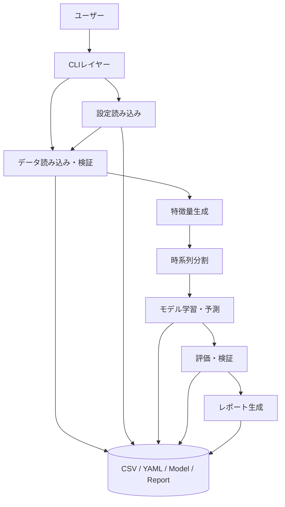
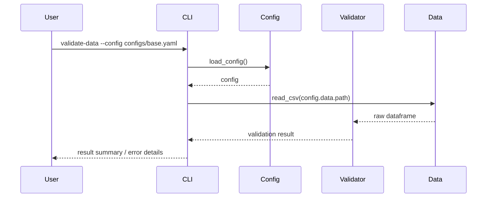
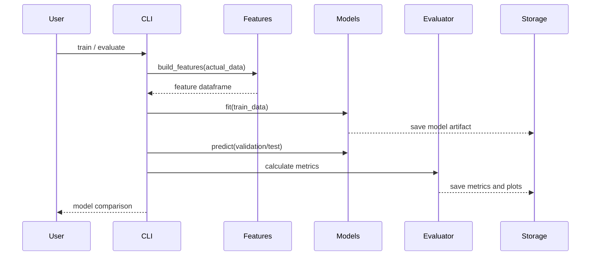

# 機能設計書 (Functional Design Document)

## システム構成図



## 技術スタック

| 分類 | 技術 | 選定理由 |
|------|------|----------|
| 言語 | Python 3.10+ | データ分析・機械学習エコシステムが成熟しており、型ヒントも利用できる |
| データ処理 | pandas / numpy | CSV、時系列、欠損、集計、特徴量生成に適している |
| 機械学習 | scikit-learn / LightGBM | 回帰モデルと非線形モデルの比較を実装しやすい |
| 時系列 | statsmodels / Prophet | SARIMAX、トレンド、季節性モデルを扱える |
| 可視化 | matplotlib / plotly | 静的レポートとHTML向けグラフ生成に対応できる |
| 設定 | PyYAML | 実行条件をYAMLで管理できる |
| CLI | argparse | 標準ライブラリで追加依存なしにCLIを提供できる。TyperはPost-MVPの改善候補とする |
| テスト | pytest | Pythonプロジェクトの単体テスト標準として扱いやすい |

## データモデル定義

### 入力CSV

```python
class RawSalesRecord(TypedDict):
    Date: str
    Sales: str | float | int | None
    TVCM_GPR: str | float | int | None
    Print_Media: str | float | int | None
    Offline_Ads: str | float | int | None
    Digital_Ads: str | float | int | None
    Record_Type: str
```

**制約**:
- `Date`、`Sales`、`Record_Type` は必須カラム。
- `Record_Type` は `Actual` または `Forecast`。
- `Actual` 行では `Sales` が必須。
- `Forecast` 行では `Sales` 欠損を許容し、外部要因は予測期間分必須。

### 内部標準データ

```python
class SalesRecord(TypedDict):
    week_start_date: datetime
    sales: float | None
    tvcm_gpr: float | None
    print_media: float | None
    offline_ads: float | None
    digital_ads: float | None
    record_type: Literal["Actual", "Forecast"]
```

### 評価結果

```python
class EvaluationResult(TypedDict):
    model_name: str
    rmse: float
    mae: float
    mape: float
    smape: float
    wape: float
    bias: float
    baseline_improvement_rate: float | None
```

## コンポーネント設計

### CLI

**責務**:
- コマンドライン引数の受付
- 設定ファイルの指定
- サービス処理の呼び出し
- 成功・失敗メッセージの表示

**主要コマンド**:
```bash
python -m sales_forecast validate-data --config configs/base.yaml
python -m sales_forecast train --config configs/base.yaml --model lightgbm
python -m sales_forecast evaluate --config configs/base.yaml
python -m sales_forecast forecast --config configs/base.yaml --model lightgbm --horizon 12
python -m sales_forecast report --config configs/base.yaml --output reports/model_comparison_report.md
```

### Config Loader

**責務**:
- YAML設定の読み込み
- パス、カラム名、モデル、評価指標、出力先の標準化
- 設定不足や不正値の検証

### Data Loader / Validator

**責務**:
- CSV読み込み
- カラム名の標準化
- 数値文字列の変換
- 日付、欠損、重複週、欠落週、`Record_Type` の検証

### Feature Engineering

**責務**:
- ラグ特徴量、移動平均、カレンダー特徴量、季節性特徴量、マーケティング特徴量の生成
- 学習時に未来データを参照しないように時系列順で計算する

### Model Registry / Models

**責務**:
- 設定ファイルのモデル名から実装クラスを解決する
- 各モデルを共通インターフェースで実行する
- モデルの利用可否を、optional dependencyの有無も含めて判定する

```python
class BaseForecastModel(Protocol):
    def fit(self, train_data: pd.DataFrame) -> None: ...
    def predict(self, future_data: pd.DataFrame) -> pd.Series: ...
```

**モデル名の初期マッピング**:

| 設定値 | 実装クラス | 優先度 |
|--------|------------|--------|
| `baseline` | `BaselineForecastModel` | P0 |
| `linear_regression` | `LinearRegressionForecastModel` | P1 |
| `lightgbm` | `LightGBMForecastModel` | P1 |
| `prophet` | `ProphetForecastModel` | P1 |
| `sarimax` | `SarimaxForecastModel` | P1 |

### Evaluator

**責務**:
- RMSE、MAE、MAPE、sMAPE、WAPE、Biasを計算する
- Baseline比改善率を計算する
- walk-forward validationの各期間スコアを保存する

### Reporter

**責務**:
- 評価結果、予測結果、グラフ、特徴量重要度、ビジネス示唆をまとめる
- HTMLまたはMarkdownレポートを生成する

## 主要ユースケース

### データ検証



### 学習・評価



## アルゴリズム設計

### 時系列分割

**目的**: ランダム分割によるデータリークを避け、過去から未来を予測する評価にする。

**方針**:
- `Actual` 行のみを学習・検証・テストに使う。
- 日付昇順にソートする。
- 設定ファイルの期間指定がある場合はそれを優先する。
- 期間指定がない場合は train / validation / test を時系列順に分割する。
- 特徴量生成でラグや移動平均を作る場合、各行の特徴量はその行より前の情報だけから計算する。
- 評価対象期間に入った後は、実績売上を特徴量に再注入しない方針を明示する。必要な場合はwalk-forward validation内でfoldごとに再学習する。

### walk-forward validation

**目的**: 複数期間でモデル性能を確認し、特定期間だけに依存した評価を避ける。

**方針**:
- 初期学習期間を固定または拡張しながら、次の検証期間を予測する。
- 各foldで同じ評価指標を算出する。
- fold別スコアと平均スコアを保存する。

### 評価指標

```text
RMSE = sqrt(mean((actual - predicted)^2))
MAE = mean(abs(actual - predicted))
MAPE = mean(abs((actual - predicted) / actual)) * 100
sMAPE = mean(2 * abs(predicted - actual) / (abs(actual) + abs(predicted))) * 100
WAPE = sum(abs(actual - predicted)) / sum(abs(actual)) * 100
Bias = mean(predicted - actual)
Baseline比改善率 = (baseline_metric - model_metric) / baseline_metric * 100
```

**ゼロ除算・欠損の扱い**:
- MAPEは `actual = 0` の行を除外して計算し、除外件数を評価結果に記録する。
- sMAPEは `abs(actual) + abs(predicted) = 0` の行を除外して計算する。
- WAPEは `sum(abs(actual)) = 0` の場合は計算不可として `NaN` を返す。
- Baseline比改善率はBaseline指標が0または欠損の場合は計算不可として `NaN` を返す。
- 評価指標の計算前に、`actual` と `predicted` のindexと長さが一致していることを検証する。

## 出力ファイル

| 種別 | 出力先例 | 内容 |
|------|----------|------|
| 学習済みモデル | `outputs/models/{model_name}.pkl` | 学習済みモデル |
| 評価結果 | `outputs/evaluation/metrics.csv` | モデル別評価指標 |
| 予測結果 | `outputs/forecast/forecast.csv` | 将来予測 |
| グラフ | `outputs/figures/*.png` | 実績・予測比較、誤差分析 |
| レポート | `reports/model_comparison_report_YYYYMMDD.md` | ビジネス向け分析レポート |

## エラーハンドリング

| エラー種別 | 処理 | ユーザーへの表示 |
|-----------|------|-----------------|
| 設定ファイル未存在 | 処理中断 | `Config file not found: ...` |
| 必須カラム不足 | 処理中断 | 不足カラム名を表示 |
| 日付不正 | 処理中断 | 不正な行番号と値を表示 |
| 数値変換不可 | 処理中断 | 対象カラム、行番号、値を表示 |
| 欠落週あり | 警告または処理中断 | 欠落している週を表示 |
| モデル名不正 | 処理中断 | 利用可能なモデル名を表示 |

## テスト戦略

### ユニットテスト
- CSV読み込みとカラム標準化
- データバリデーション
- 特徴量生成
- 評価指標
- Baseline Model

### 統合テスト
- `validate-data` がサンプルデータで成功する
- `train` から `evaluate` までの最小パイプラインが成功する
- `forecast` が12週間予測CSVを生成する

### E2Eテスト
- サンプルデータからHTMLレポート生成まで一連のCLIが成功する
