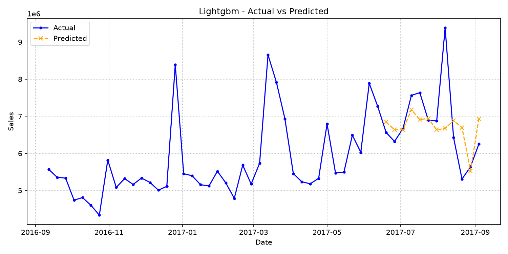
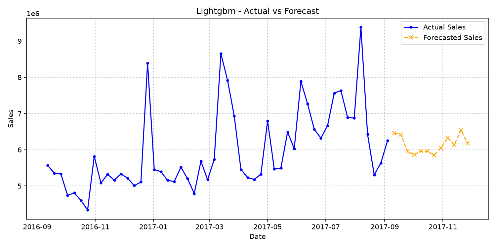

# LightGBM Report

Report date: 2026-07-04

## Model Overview
A gradient boosting model designed to capture nonlinear effects and interactions among calendar, lag, rolling, and marketing features.

## Features and Preprocessing
Uses the same forecast-safe feature set as the tabular models, with tree-based splits handling nonlinear thresholds.
Configured external features: TVCM_GPR, Print_Media, Offline_Ads, Digital_Ads.
Forecast-safe lag and rolling features must be derived only from past sales values.

## Dataset Overview
| Segment | Rows | Start | End | Average Sales | Minimum Sales | Maximum Sales |
| --- | --- | --- | --- | --- | --- | --- |
| Actual | 105 | 2015-09-07 | 2017-09-04 | N/A | N/A | N/A |
| Forecast Inputs | 16 | 2017-09-11 | 2017-12-25 | N/A | N/A | N/A |

Actual rows are used for backtesting and model fitting. Forecast-input rows provide future dates and external assumptions; future Sales values are not used as features.

## External Regressor Review
| Feature | Average | Minimum | Maximum | Non-Zero Weeks |
| --- | --- | --- | --- | --- |
| TVCM_GPR | 82.28 | 0.00 | 419.03 | 65.29% |
| Print_Media | 8,263,553.72 | 0.00 | 108,530,000.00 | 57.85% |
| Offline_Ads | 3,227,024.79 | 0.00 | 27,850,000.00 | 33.88% |
| Digital_Ads | N/A | N/A | N/A | 0.00% |

Notebook experiments treated these variables as external regressors and tested lagged or residual advertising effects. This report summarizes their available signal before interpreting model accuracy.

## Training and Evaluation Conditions
Validation weeks: 12
Test weeks: 12
Forecast horizon: 12 weeks
Evaluation metrics: rmse, mae, mape, smape, wape, bias.

## Evaluation Metrics
| Model | RMSE | MAE | MAPE | SMAPE | WAPE | Bias | Baseline Improvement |
| --- | --- | --- | --- | --- | --- | --- | --- |
| lightgbm | 951,493.63 | 613,970.24 | 8.62% | 8.75% | 9.04% | -86,617.30 | 2.65% |

## Evaluation Interpretation
- Error scale: RMSE is 951,493.63 and MAE is 613,970.24. A large gap between RMSE and MAE means a few weeks have outsized errors and should be inspected individually.
- Relative accuracy: WAPE is 9.04%, which expresses absolute error as a share of actual sales volume.
- Baseline value: lightgbm shows 2.65% baseline improvement by RMSE. Positive values mean the model improves on the configured baseline; negative values mean the baseline is still stronger.
- Bias direction: average bias is -86,617.30. Negative bias means the model tends to over-forecast actual sales.

## Train / Test Split and Test Evaluation

The model is fitted on the combined training and validation sets (train + validation) and evaluated on the holdout test period. This process ensures the metrics represent generalization performance on unseen data before executing the final forecast.

### Evaluation Conditions & Period
- **Validation Configuration**: 12 weeks
- **Test Configuration**: 12 weeks
- **Test Period**: 2017-06-19 to 2017-09-04
- **Number of Weeks**: 12

### Representative Metrics
- **RMSE**: 951,493.63
- **WAPE**: 9.04%
- **Bias**: -86,617.30

### Deviation Trend Analysis
During the evaluation period, the model shows a net bias of -86,617.30, indicating a tendency toward over-forecasting (predicted sales exceeded actual).

### Test Evaluation Visualization

## 12-Week Forecast Summary
| Metric | Value |
| --- | --- |
| Weeks | 12 |
| Average Prediction | 6,142,842.13 |
| Minimum Prediction | 5,854,035.21 |
| Maximum Prediction | 6,540,472.53 |
| Forecast Window | 2017-09-11 to 2017-11-27 |

### 12-Week Forecast Preview

| Week Start Date | Prediction |
| --- | --- |
| 2017-09-11 | 6,459,450.01 |
| 2017-09-18 | 6,422,366.98 |
| 2017-09-25 | 5,950,899.26 |
| 2017-10-02 | 5,862,040.84 |
| 2017-10-09 | 5,958,823.89 |
| 2017-10-16 | 5,958,823.89 |
| 2017-10-23 | 5,854,035.21 |
| 2017-10-30 | 6,052,392.87 |
| 2017-11-06 | 6,331,669.41 |
| 2017-11-13 | 6,138,625.77 |
| 2017-11-20 | 6,540,472.53 |
| 2017-11-27 | 6,184,504.90 |

### Forecast Visualization

## Forecast Pattern Analysis
| Metric | Value |
| --- | --- |
| First Week | 6,459,450.01 |
| Final Week | 6,184,504.90 |
| Final vs First | -274,945.11 |
| First 6 Week Average | 6,102,067.48 |
| Last 6 Week Average | 6,183,616.78 |
| Back-Half Lift | 81,549.30 |

Use this pattern check with campaign calendars and inventory plans. A rising back half may reflect future regressor assumptions or seasonal structure; a flat line can indicate conservative extrapolation.

## Model-Specific Interpretation
LightGBM results should be read through relative error reduction and, when available, feature importance or SHAP-style diagnostics.

## Notebook-Inspired Diagnostic Checklist
- Review feature importance for lag sales, rolling means, calendar variables, and advertising inputs.
- Check early-stopping behavior and whether tree depth is appropriate for the small weekly dataset.
- Compare test-week actual vs predicted lines to find nonlinear promotion response failures.
- Watch for overfitting when boosted trees outperform training history but do not improve holdout WAPE.

## Limitations
Boosted trees can overfit small weekly datasets and do not extrapolate trend or seasonality as explicitly as time-series models.

## Next Things to Review
Review validation-period stability, tune tree depth and learning rate, and add feature importance output if the model is promoted.
