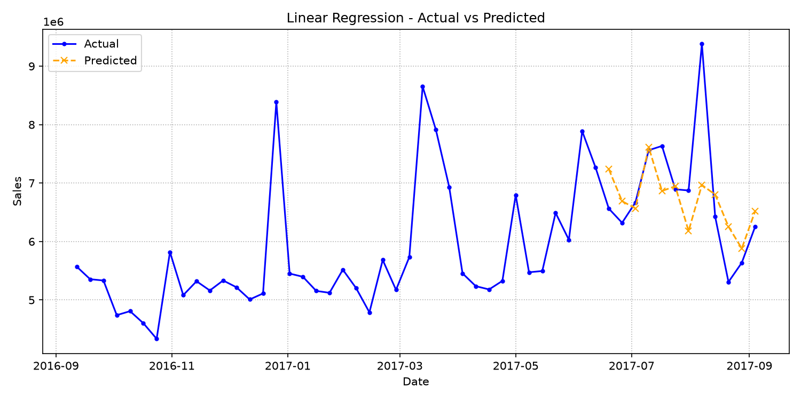
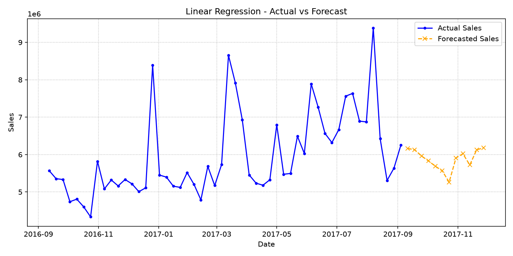

# Linear Regression Report

Report date: 2026-07-04

## Model Overview
A transparent regression baseline that combines calendar, lag, rolling average, and marketing variables to explain weekly sales.

## Features and Preprocessing
Uses engineered weekly time-series features such as lag sales, rolling means, calendar signals, and configured external marketing features.
Configured external features: TVCM_GPR, Print_Media, Offline_Ads, Digital_Ads.
Forecast-safe lag and rolling features must be derived only from past sales values.

## Dataset Overview
| Segment | Rows | Start | End | Average Sales | Minimum Sales | Maximum Sales |
| --- | --- | --- | --- | --- | --- | --- |
| Actual | 105 | 2015-09-07 | 2017-09-04 | N/A | N/A | N/A |
| Forecast Inputs | 16 | 2017-09-11 | 2017-12-25 | N/A | N/A | N/A |

Actual rows are used for backtesting and model fitting. Forecast-input rows provide future dates and external assumptions; future Sales values are not used as features.

## External Regressor Review
| Feature | Average | Minimum | Maximum | Non-Zero Weeks |
| --- | --- | --- | --- | --- |
| TVCM_GPR | 82.28 | 0.00 | 419.03 | 65.29% |
| Print_Media | 8,263,553.72 | 0.00 | 108,530,000.00 | 57.85% |
| Offline_Ads | 3,227,024.79 | 0.00 | 27,850,000.00 | 33.88% |
| Digital_Ads | N/A | N/A | N/A | 0.00% |

Notebook experiments treated these variables as external regressors and tested lagged or residual advertising effects. This report summarizes their available signal before interpreting model accuracy.

## Training and Evaluation Conditions
Validation weeks: 12
Test weeks: 12
Forecast horizon: 12 weeks
Evaluation metrics: rmse, mae, mape, smape, wape, bias.

## Evaluation Metrics
| Model | RMSE | MAE | MAPE | SMAPE | WAPE | Bias | Baseline Improvement |
| --- | --- | --- | --- | --- | --- | --- | --- |
| linear_regression | 850,825.94 | 580,324.83 | 8.11% | 8.31% | 8.54% | -83,034.53 | 12.95% |

## Evaluation Interpretation
- Error scale: RMSE is 850,825.94 and MAE is 580,324.83. A large gap between RMSE and MAE means a few weeks have outsized errors and should be inspected individually.
- Relative accuracy: WAPE is 8.54%, which expresses absolute error as a share of actual sales volume.
- Baseline value: linear_regression shows 12.95% baseline improvement by RMSE. Positive values mean the model improves on the configured baseline; negative values mean the baseline is still stronger.
- Bias direction: average bias is -83,034.53. Negative bias means the model tends to over-forecast actual sales.

## Train / Test Split and Test Evaluation

The model is fitted on the combined training and validation sets (train + validation) and evaluated on the holdout test period. This process ensures the metrics represent generalization performance on unseen data before executing the final forecast.

### Evaluation Conditions & Period
- **Validation Configuration**: 12 weeks
- **Test Configuration**: 12 weeks
- **Test Period**: 2017-06-19 to 2017-09-04
- **Number of Weeks**: 12

### Representative Metrics
- **RMSE**: 850,825.94
- **WAPE**: 8.54%
- **Bias**: -83,034.53

### Deviation Trend Analysis
During the evaluation period, the model shows a net bias of -83,034.53, indicating a tendency toward over-forecasting (predicted sales exceeded actual).

### Test Evaluation Visualization

## 12-Week Forecast Summary
| Metric | Value |
| --- | --- |
| Weeks | 12 |
| Average Prediction | 5,880,760.27 |
| Minimum Prediction | 5,262,760.83 |
| Maximum Prediction | 6,179,746.31 |
| Forecast Window | 2017-09-11 to 2017-11-27 |

### 12-Week Forecast Preview

| Week Start Date | Prediction |
| --- | --- |
| 2017-09-11 | 6,162,907.52 |
| 2017-09-18 | 6,130,351.94 |
| 2017-09-25 | 5,961,725.09 |
| 2017-10-02 | 5,830,944.27 |
| 2017-10-09 | 5,689,603.61 |
| 2017-10-16 | 5,566,386.19 |
| 2017-10-23 | 5,262,760.83 |
| 2017-10-30 | 5,911,203.79 |
| 2017-11-06 | 6,023,046.09 |
| 2017-11-13 | 5,721,443.29 |
| 2017-11-20 | 6,129,004.34 |
| 2017-11-27 | 6,179,746.31 |

### Forecast Visualization

## Forecast Pattern Analysis
| Metric | Value |
| --- | --- |
| First Week | 6,162,907.52 |
| Final Week | 6,179,746.31 |
| Final vs First | 16,838.79 |
| First 6 Week Average | 5,890,319.77 |
| Last 6 Week Average | 5,871,200.77 |
| Back-Half Lift | -19,119.00 |

Use this pattern check with campaign calendars and inventory plans. A rising back half may reflect future regressor assumptions or seasonal structure; a flat line can indicate conservative extrapolation.

## Model-Specific Interpretation
This model is useful for checking directional feature effects and whether simple linear relationships improve on seasonal naive behavior.

## Notebook-Inspired Diagnostic Checklist
- Review coefficient signs for TVCM, Print, Offline, and Digital regressors.
- Check whether residual-effect or lagged advertising variables explain delayed sales response.
- Inspect residual plots for remaining seasonality, holiday spikes, and high-leverage weeks.
- Confirm monthly and holiday dummies are not absorbing marketing effects that should be interpreted separately.

## Limitations
Linear effects can miss nonlinear promotion response, saturation, and interaction patterns across media channels.

## Next Things to Review
Inspect coefficient stability, residual seasonality, and large error weeks before using the model for planning decisions.
