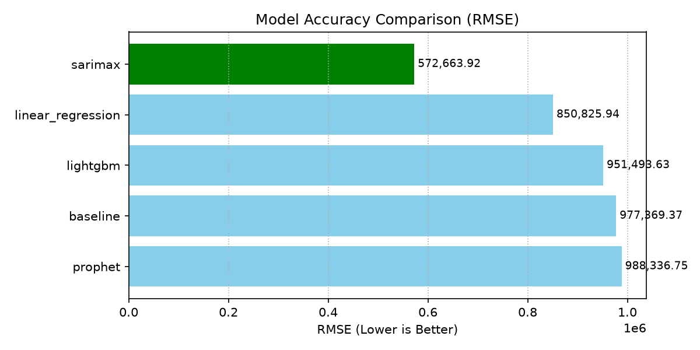
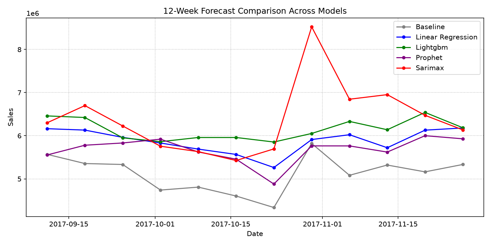

# Model Comparison Report

Report date: 2026-07-04

## Model Comparison
| Model | RMSE | MAE | MAPE | SMAPE | WAPE | Bias | Baseline Improvement |
| --- | --- | --- | --- | --- | --- | --- | --- |
| baseline | 977,369.37 | 772,958.08 | 11.34% | 12.07% | 11.38% | -506,135.25 | 0.00% |
| linear_regression | 850,825.94 | 580,324.83 | 8.11% | 8.31% | 8.54% | -83,034.53 | 12.95% |
| lightgbm | 951,493.63 | 613,970.24 | 8.62% | 8.75% | 9.04% | -86,617.30 | 2.65% |
| prophet | 988,336.75 | 775,363.49 | 12.36% | 11.35% | 11.41% | 540,794.87 | -1.12% |
| sarimax | 572,663.92 | 454,440.58 | 6.80% | 6.74% | 6.69% | -160,165.22 | 41.41% |

## Accuracy Ranking
| Rank | Model | RMSE | WAPE | Bias | Baseline Improvement |
| --- | --- | --- | --- | --- | --- |
| 1 | sarimax | 572,663.92 | 6.69% | -160,165.22 | 41.41% |
| 2 | linear_regression | 850,825.94 | 8.54% | -83,034.53 | 12.95% |
| 3 | lightgbm | 951,493.63 | 9.04% | -86,617.30 | 2.65% |
| 4 | baseline | 977,369.37 | 11.38% | -506,135.25 | 0.00% |
| 5 | prophet | 988,336.75 | 11.41% | 540,794.87 | -1.12% |

### Accuracy Ranking Visualization

## Best Model
Best model by RMSE: **sarimax**.

## 12-Week Forecast
Forecast generated by the best model: **sarimax**.

| Metric | Value |
| --- | --- |
| Weeks | 12 |
| Average Prediction | 6,388,543.50 |
| Minimum Prediction | 5,425,102.47 |
| Maximum Prediction | 8,524,406.32 |
| Forecast Window | 2017-09-11 to 2017-11-27 |

### 12-Week Forecast Preview

| Week Start Date | Prediction |
| --- | --- |
| 2017-09-11 | 6,299,636.64 |
| 2017-09-18 | 6,698,627.36 |
| 2017-09-25 | 6,226,297.49 |
| 2017-10-02 | 5,756,498.41 |
| 2017-10-09 | 5,631,236.45 |
| 2017-10-16 | 5,425,102.47 |
| 2017-10-23 | 5,693,979.86 |
| 2017-10-30 | 8,524,406.32 |
| 2017-11-06 | 6,846,152.28 |
| 2017-11-13 | 6,952,538.86 |
| 2017-11-20 | 6,472,852.73 |
| 2017-11-27 | 6,135,193.08 |

## Baseline Improvement
sarimax baseline improvement: **41.41%**.

## Forecast Range Comparison
| Model | Average Prediction | Minimum Prediction | Maximum Prediction | Range |
| --- | --- | --- | --- | --- |
| baseline | 5,121,746.58 | 4,335,326.00 | 5,820,529.00 | 1,485,203.00 |
| linear_regression | 5,880,760.27 | 5,262,760.83 | 6,179,746.31 | 916,985.48 |
| lightgbm | 6,142,842.13 | 5,854,035.21 | 6,540,472.53 | 686,437.32 |
| prophet | 5,676,861.09 | 4,879,956.25 | 6,000,707.11 | 1,120,750.86 |
| sarimax | 6,388,543.50 | 5,425,102.47 | 8,524,406.32 | 3,099,303.85 |

### Forecast Range Comparison Visualization

## Forecast Result Reading Guide
Use the 12-week forecasts in `outputs/forecast` alongside RMSE, MAE, WAPE, and bias to judge both accuracy and planning risk.

## Business Insights
Models with positive baseline improvement add value beyond seasonal naive history. Bias should be reviewed before converting forecasts into inventory or marketing budget decisions.

## Limitations
This report summarizes existing evaluation and forecast CSV files only. Missing or stale outputs are reported as unavailable rather than triggering model runs.

## Next Steps
- Run evaluate after changing training data, feature logic, or model parameters.
- Review model-specific Markdown reports before selecting a production candidate.
- Investigate high-bias models even when their RMSE is competitive.
