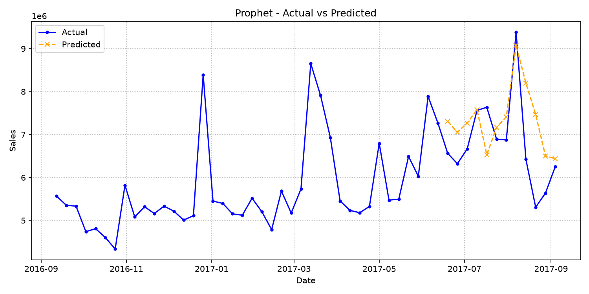
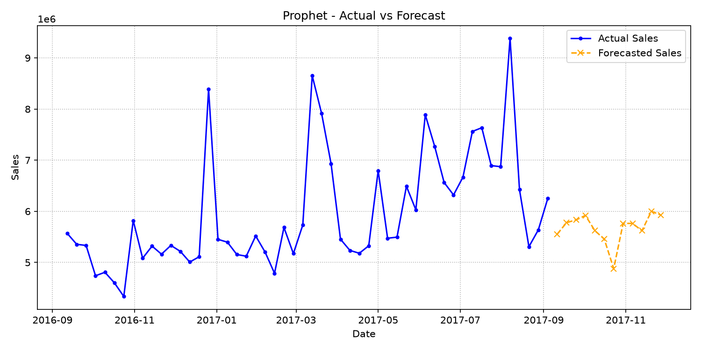

# Prophet Report

Report date: 2026-07-04

## Model Overview
A decomposable time-series model that represents trend and seasonal components with optional external regressors.

## Features and Preprocessing
Uses the weekly date index, sales history, yearly seasonality settings, and configured external regressors where available.
Configured external features: TVCM_GPR, Print_Media, Offline_Ads, Digital_Ads.
Forecast-safe lag and rolling features must be derived only from past sales values.

## Dataset Overview
| Segment | Rows | Start | End | Average Sales | Minimum Sales | Maximum Sales |
| --- | --- | --- | --- | --- | --- | --- |
| Actual | 105 | 2015-09-07 | 2017-09-04 | N/A | N/A | N/A |
| Forecast Inputs | 16 | 2017-09-11 | 2017-12-25 | N/A | N/A | N/A |

Actual rows are used for backtesting and model fitting. Forecast-input rows provide future dates and external assumptions; future Sales values are not used as features.

## External Regressor Review
| Feature | Average | Minimum | Maximum | Non-Zero Weeks |
| --- | --- | --- | --- | --- |
| TVCM_GPR | 82.28 | 0.00 | 419.03 | 65.29% |
| Print_Media | 8,263,553.72 | 0.00 | 108,530,000.00 | 57.85% |
| Offline_Ads | 3,227,024.79 | 0.00 | 27,850,000.00 | 33.88% |
| Digital_Ads | N/A | N/A | N/A | 0.00% |

Notebook experiments treated these variables as external regressors and tested lagged or residual advertising effects. This report summarizes their available signal before interpreting model accuracy.

## Training and Evaluation Conditions
Validation weeks: 12
Test weeks: 12
Forecast horizon: 12 weeks
Evaluation metrics: rmse, mae, mape, smape, wape, bias.

## Evaluation Metrics
| Model | RMSE | MAE | MAPE | SMAPE | WAPE | Bias | Baseline Improvement |
| --- | --- | --- | --- | --- | --- | --- | --- |
| prophet | 988,336.75 | 775,363.49 | 12.36% | 11.35% | 11.41% | 540,794.87 | -1.12% |

## Evaluation Interpretation
- Error scale: RMSE is 988,336.75 and MAE is 775,363.49. A large gap between RMSE and MAE means a few weeks have outsized errors and should be inspected individually.
- Relative accuracy: WAPE is 11.41%, which expresses absolute error as a share of actual sales volume.
- Baseline value: prophet shows -1.12% baseline improvement by RMSE. Positive values mean the model improves on the configured baseline; negative values mean the baseline is still stronger.
- Bias direction: average bias is 540,794.87. Positive bias means the model tends to under-forecast actual sales.

## Train / Test Split and Test Evaluation

The model is fitted on the combined training and validation sets (train + validation) and evaluated on the holdout test period. This process ensures the metrics represent generalization performance on unseen data before executing the final forecast.

### Evaluation Conditions & Period
- **Validation Configuration**: 12 weeks
- **Test Configuration**: 12 weeks
- **Test Period**: 2017-06-19 to 2017-09-04
- **Number of Weeks**: 12

### Representative Metrics
- **RMSE**: 988,336.75
- **WAPE**: 11.41%
- **Bias**: 540,794.87

### Deviation Trend Analysis
During the evaluation period, the model shows a net bias of 540,794.87, indicating a tendency toward under-forecasting (actual sales exceeded prediction).

### Test Evaluation Visualization

## 12-Week Forecast Summary
| Metric | Value |
| --- | --- |
| Weeks | 12 |
| Average Prediction | 5,676,861.09 |
| Minimum Prediction | 4,879,956.25 |
| Maximum Prediction | 6,000,707.11 |
| Forecast Window | 2017-09-11 to 2017-11-27 |

### 12-Week Forecast Preview

| Week Start Date | Prediction |
| --- | --- |
| 2017-09-11 | 5,553,864.42 |
| 2017-09-18 | 5,779,512.10 |
| 2017-09-25 | 5,831,844.83 |
| 2017-10-02 | 5,919,920.43 |
| 2017-10-09 | 5,622,557.86 |
| 2017-10-16 | 5,456,688.39 |
| 2017-10-23 | 4,879,956.25 |
| 2017-10-30 | 5,764,248.81 |
| 2017-11-06 | 5,763,696.01 |
| 2017-11-13 | 5,620,916.68 |
| 2017-11-20 | 6,000,707.11 |
| 2017-11-27 | 5,928,420.19 |

### Forecast Visualization

## Forecast Pattern Analysis
| Metric | Value |
| --- | --- |
| First Week | 5,553,864.42 |
| Final Week | 5,928,420.19 |
| Final vs First | 374,555.77 |
| First 6 Week Average | 5,694,064.67 |
| Last 6 Week Average | 5,659,657.51 |
| Back-Half Lift | -34,407.16 |

Use this pattern check with campaign calendars and inventory plans. A rising back half may reflect future regressor assumptions or seasonal structure; a flat line can indicate conservative extrapolation.

## Model-Specific Interpretation
Prophet is most informative when trend and seasonal decomposition are important for explaining forecast movement.

## Notebook-Inspired Diagnostic Checklist
- Inspect trend, changepoint, and yearly seasonality components before using the forecast operationally.
- Confirm external regressors are available for every forecast week and are on the same scale as training data.
- Compare additive vs multiplicative seasonality when sales peaks scale with the overall level.
- Check uncertainty intervals if they are exported in a future artifact.

## Limitations
Performance depends on whether the built-in trend and seasonality assumptions fit the retail series and available history.

## Next Things to Review
Check holiday effects, changepoints, and component plots before relying on the forecast for long-horizon decisions.
