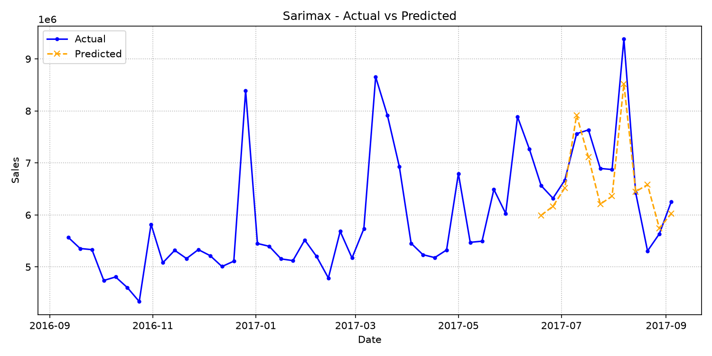
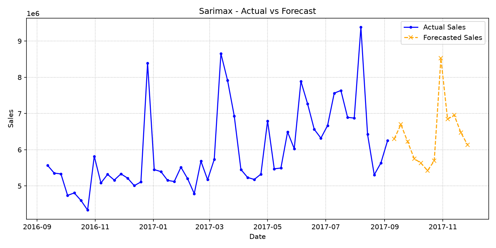

# SARIMAX Report

Report date: 2026-07-04

## Model Overview
A seasonal autoregressive time-series model that uses past sales structure and optional exogenous regressors.

## Features and Preprocessing
Uses the ordered weekly sales series with configured SARIMAX order, seasonal order, trend, and any exogenous variables provided by the pipeline.
Configured external features: TVCM_GPR, Print_Media, Offline_Ads, Digital_Ads.
Forecast-safe lag and rolling features must be derived only from past sales values.

## Dataset Overview
| Segment | Rows | Start | End | Average Sales | Minimum Sales | Maximum Sales |
| --- | --- | --- | --- | --- | --- | --- |
| Actual | 105 | 2015-09-07 | 2017-09-04 | N/A | N/A | N/A |
| Forecast Inputs | 16 | 2017-09-11 | 2017-12-25 | N/A | N/A | N/A |

Actual rows are used for backtesting and model fitting. Forecast-input rows provide future dates and external assumptions; future Sales values are not used as features.

## External Regressor Review
| Feature | Average | Minimum | Maximum | Non-Zero Weeks |
| --- | --- | --- | --- | --- |
| TVCM_GPR | 82.28 | 0.00 | 419.03 | 65.29% |
| Print_Media | 8,263,553.72 | 0.00 | 108,530,000.00 | 57.85% |
| Offline_Ads | 3,227,024.79 | 0.00 | 27,850,000.00 | 33.88% |
| Digital_Ads | N/A | N/A | N/A | 0.00% |

Notebook experiments treated these variables as external regressors and tested lagged or residual advertising effects. This report summarizes their available signal before interpreting model accuracy.

## Training and Evaluation Conditions
Validation weeks: 12
Test weeks: 12
Forecast horizon: 12 weeks
Evaluation metrics: rmse, mae, mape, smape, wape, bias.

## Evaluation Metrics
| Model | RMSE | MAE | MAPE | SMAPE | WAPE | Bias | Baseline Improvement |
| --- | --- | --- | --- | --- | --- | --- | --- |
| sarimax | 572,663.92 | 454,440.58 | 6.80% | 6.74% | 6.69% | -160,165.22 | 41.41% |

## Evaluation Interpretation
- Error scale: RMSE is 572,663.92 and MAE is 454,440.58. A large gap between RMSE and MAE means a few weeks have outsized errors and should be inspected individually.
- Relative accuracy: WAPE is 6.69%, which expresses absolute error as a share of actual sales volume.
- Baseline value: sarimax shows 41.41% baseline improvement by RMSE. Positive values mean the model improves on the configured baseline; negative values mean the baseline is still stronger.
- Bias direction: average bias is -160,165.22. Negative bias means the model tends to over-forecast actual sales.

## Train / Test Split and Test Evaluation

The model is fitted on the combined training and validation sets (train + validation) and evaluated on the holdout test period. This process ensures the metrics represent generalization performance on unseen data before executing the final forecast.

### Evaluation Conditions & Period
- **Validation Configuration**: 12 weeks
- **Test Configuration**: 12 weeks
- **Test Period**: 2017-06-19 to 2017-09-04
- **Number of Weeks**: 12

### Representative Metrics
- **RMSE**: 572,663.92
- **WAPE**: 6.69%
- **Bias**: -160,165.22

### Deviation Trend Analysis
During the evaluation period, the model shows a net bias of -160,165.22, indicating a tendency toward over-forecasting (predicted sales exceeded actual).

### Test Evaluation Visualization

## 12-Week Forecast Summary
| Metric | Value |
| --- | --- |
| Weeks | 12 |
| Average Prediction | 6,388,543.50 |
| Minimum Prediction | 5,425,102.47 |
| Maximum Prediction | 8,524,406.32 |
| Forecast Window | 2017-09-11 to 2017-11-27 |

### 12-Week Forecast Preview

| Week Start Date | Prediction |
| --- | --- |
| 2017-09-11 | 6,299,636.64 |
| 2017-09-18 | 6,698,627.36 |
| 2017-09-25 | 6,226,297.49 |
| 2017-10-02 | 5,756,498.41 |
| 2017-10-09 | 5,631,236.45 |
| 2017-10-16 | 5,425,102.47 |
| 2017-10-23 | 5,693,979.86 |
| 2017-10-30 | 8,524,406.32 |
| 2017-11-06 | 6,846,152.28 |
| 2017-11-13 | 6,952,538.86 |
| 2017-11-20 | 6,472,852.73 |
| 2017-11-27 | 6,135,193.08 |

### Forecast Visualization

## Forecast Pattern Analysis
| Metric | Value |
| --- | --- |
| First Week | 6,299,636.64 |
| Final Week | 6,135,193.08 |
| Final vs First | -164,443.56 |
| First 6 Week Average | 6,006,233.14 |
| Last 6 Week Average | 6,770,853.85 |
| Back-Half Lift | 764,620.72 |

Use this pattern check with campaign calendars and inventory plans. A rising back half may reflect future regressor assumptions or seasonal structure; a flat line can indicate conservative extrapolation.

## Model-Specific Interpretation
SARIMAX is useful when autocorrelation and annual weekly seasonality explain a large share of sales movement.

## Notebook-Inspired Diagnostic Checklist
- Review selected order and seasonal_order against weekly annual seasonality assumptions.
- Inspect residual autocorrelation and convergence warnings after fitting.
- Confirm exogenous regressors are aligned by week and known for the full forecast horizon.
- Treat short history as a limitation because seasonal differencing with m=52 needs enough annual cycles.

## Limitations
The model is sensitive to stationarity, parameter choice, and the amount of historical data available for seasonal estimation.

## Next Things to Review
Inspect residual autocorrelation, convergence warnings, and seasonal parameter sensitivity before operational use.
